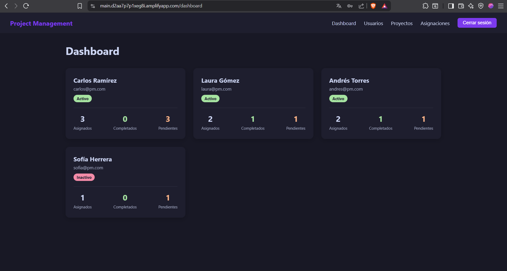
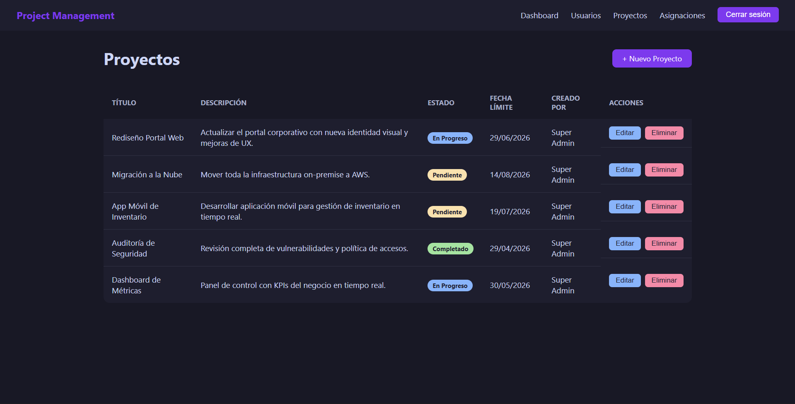
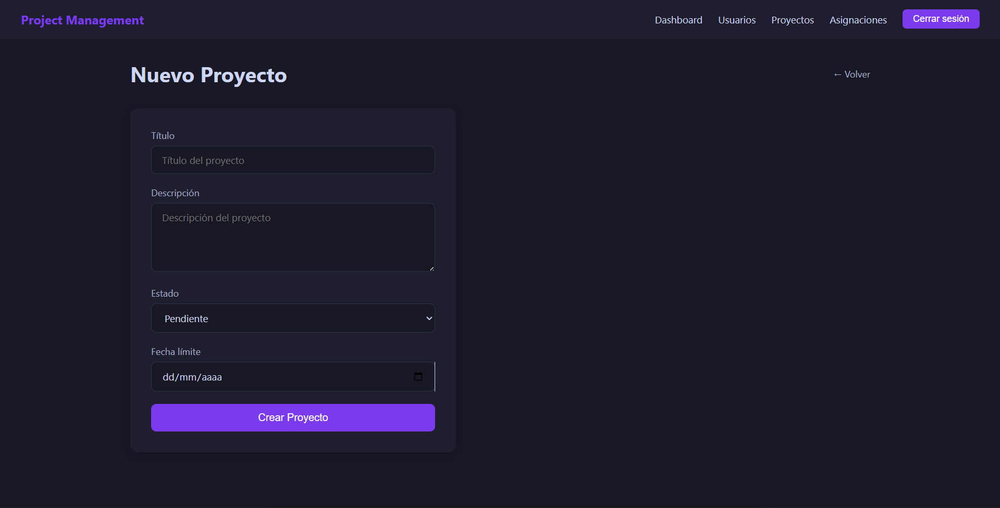
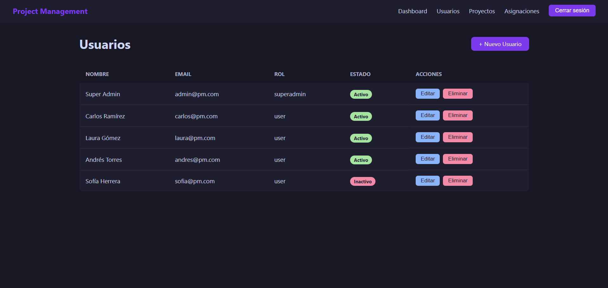

# 📊 Sistema de Gestión de Proyectos
 
> Aplicación web full-stack de 3 capas para la gestión integral de proyectos, tareas y equipos de trabajo.
 
## 📑 Tabla de Contenidos
 
- [Descripción del Proyecto](#-descripción-del-proyecto)
- [Equipo de Desarrollo](#-equipo-de-desarrollo)
- [Arquitectura del Sistema](#️-arquitectura-del-sistema)
- [Tecnologías Utilizadas](#-tecnologías-utilizadas)
- [Características Principales](#-características-principales)
- [Requisitos Previos](#-requisitos-previos)
- [Instalación y Configuración](#-instalación-y-configuración)
- [Despliegue en AWS](#-despliegue-en-aws)
- [Estructura del Proyecto](#-estructura-del-proyecto)
- [API Endpoints](#-api-endpoints)
- [Variables de Entorno](#-variables-de-entorno)
- [Scripts Disponibles](#-scripts-disponibles)
- [Capturas de Pantalla](#-capturas-de-pantalla)
- [Licencia](#-licencia)
---
 
## 📋 Descripción del Proyecto
 
**Mi Gestión Proyectos** es una aplicación web completa que permite a equipos de trabajo organizar, administrar y dar seguimiento a proyectos de manera eficiente. La aplicación implementa una arquitectura de 3 capas (Frontend, Backend y Base de Datos) que facilita la escalabilidad y el mantenimiento del sistema.
 
El sistema permite crear proyectos, asignar tareas a miembros del equipo, monitorear el progreso mediante dashboards visuales y gestionar roles de usuario con diferentes niveles de acceso.
 
---
 
## 👥 Equipo de Desarrollo
 
Este proyecto fue desarrollado como trabajo final del curso **TS5C4 - Programación Web - G401** de la **Universidad Tecnológica de Pereira**.
 
| Nombre | Rol | Responsabilidades |
|--------|-----|-------------------|
| **Juan José Ospina** | Backend Developer | API REST, lógica de negocio, autenticación, endpoints |
| **Mateo Cifuentes** | Frontend Developer | Interfaz de usuario, componentes, navegación, consumo de API |
| **Santiago Quintero** | Database Administrator | Diseño del modelo de datos, migraciones, consultas, optimización |
 
---
 
## 🏗️ Arquitectura del Sistema
 
La aplicación sigue una arquitectura de 3 capas:
 
```
┌─────────────────────────────────────────────────────────────┐
│                     CAPA DE PRESENTACIÓN                     │
│                      (Frontend - React)                      │
│               Desplegado en AWS Amplify                      │
└────────────────────────┬────────────────────────────────────┘
                         │ HTTP/REST API
                         ▼
┌─────────────────────────────────────────────────────────────┐
│                      CAPA DE NEGOCIO                         │
│                  (Backend - Node.js/Express)                 │
│                 Desplegado en AWS EC2 Ubuntu                 │
└────────────────────────┬────────────────────────────────────┘
                         │ SQL Queries
                         ▼
┌─────────────────────────────────────────────────────────────┐
│                       CAPA DE DATOS                          │
│                      (Base de Datos MySQL)                   │
│                    Desplegado en AWS RDS                     │
└─────────────────────────────────────────────────────────────┘
```
 
---
 
#---

## 🛠 Tecnologías Utilizadas

### **Frontend**
- **Framework:** Angular
- **Lenguaje:** TypeScript
- **Estilos:** SCSS
- **Servidor:** Nginx
- **Despliegue:** AWS Amplify

### **Backend**
- **Runtime:** Node.js 18+
- **Framework:** Express.js
- **Lenguaje:** TypeScript
- **Driver:** MySQL2
- **Autenticación:** JWT (JSON Web Tokens)
- **Despliegue:** AWS EC2 (`3.20.236.1`)

### **Base de Datos**
- **Motor:** MySQL 8.0
- **Hosting:** AWS RDS

### **DevOps y Herramientas**
- **Containerización:** Docker, Docker Compose
- **Proxy:** Nginx
- **Control de Versiones:** Git & GitHub

---

## ✨ Características Principales

### **Gestión de Proyectos**
- ✅ Crear, editar y eliminar proyectos
- ✅ Asignar proyectos a equipos de trabajo
- ✅ Establecer fechas de inicio y finalización
- ✅ Monitorear el estado del proyecto

### **Gestión de Tareas**
- ✅ CRUD completo de tareas
- ✅ Asignación de tareas a usuarios específicos
- ✅ Priorización de tareas (Alta, Media, Baja)
- ✅ Estados de tareas (Por Hacer, En Progreso, Completada)

### **Gestión de Usuarios**
- ✅ Registro y autenticación de usuarios
- ✅ Roles y permisos
- ✅ Perfil de usuario personalizable

### **Dashboard y Reportes**
- ✅ Vista general del progreso de proyectos
- ✅ Filtros y búsquedas avanzadas

---

## 📦 Requisitos Previos

- **Node.js** 18.x o superior
- **npm** 9.x o superior
- **MySQL** 8.0 o superior
- **Git**
- **Docker** (opcional)

---

## 🚀 Instalación y Configuración

### **1. Clonar el Repositorio**

```bash
git clone https://github.com/juan-jose-ospina/mi-gestion-proyectos.git
cd mi-gestion-proyectos
```
 
### **2. Configurar la Base de Datos**
 
#### **Opción A: MySQL Local**
 
```bash
# Iniciar sesión en MySQL
mysql -u root -p
 
# Crear la base de datos
CREATE DATABASE gestion_proyectos;
 
# Importar el esquema inicial
mysql -u root -p gestion_proyectos < database/schema.sql
 
# Importar datos de prueba (opcional)
mysql -u root -p gestion_proyectos < database/seed.sql
```
 
#### **Opción B: Usar Docker Compose**
 
```bash
# Levantar todos los servicios (Frontend, Backend, MySQL)
docker-compose up -d
 
# Ver los logs
docker-compose logs -f
```
 
### **3. Configurar el Backend**
 
```bash
cd backend
 
# Instalar dependencias
npm install
 
# Crear archivo .env basado en el ejemplo
cp .env.example .env
 
# Editar .env con tus credenciales
nano .env
```
 
**Contenido del archivo `.env`:**
```env
# Server Configuration
PORT=3000
NODE_ENV=development
 
# Database Configuration
DB_HOST=localhost
DB_PORT=3306
DB_USER=root
DB_PASSWORD=tu_contraseña
DB_NAME=gestion_proyectos
 
# JWT Secret
JWT_SECRET=tu_clave_secreta_muy_segura
JWT_EXPIRES_IN=24h
 
# CORS
FRONTEND_URL=http://localhost:4200
```
 
```bash
# Compilar TypeScript
npm run build
 
# Iniciar el servidor en modo desarrollo
npm run dev
 
# O en modo producción
npm start
```
 
El backend estará disponible en: `http://localhost:3000`
 
### **4. Configurar el Frontend**
 
```bash
cd frontend
 
# Instalar dependencias
npm install
 
# Crear archivo de configuración de entorno
cp src/environments/environment.example.ts src/environments/environment.ts
 
# Editar la URL del backend
nano src/environments/environment.ts
```
 
**Contenido de `environment.ts`:**
```typescript
export const environment = {
  production: false,
  apiUrl: 'http://localhost:3000/api'
};
```
 
```bash
# Iniciar el servidor de desarrollo
npm start
 
# O construir para producción
npm run build
```
 
El frontend estará disponible en: `http://localhost:4200`
 
---
 
## ☁️ Despliegue en AWS
 
### **Frontend - AWS Amplify**
 
1. Conecta tu repositorio de GitHub a AWS Amplify
2. Selecciona la carpeta `/frontend` como raíz
3. Configura las variables de entorno:
   ```
   REACT_APP_API_URL=https://tu-backend.com/api
   ```
4. Deploy automático en cada push a `main`
**URL de producción:** `https://tu-app.amplifyapp.com`
 
### **Backend - AWS EC2 (Ubuntu)**
 
```bash
# Conectar al servidor EC2
ssh -i tu-clave.pem ubuntu@tu-ip-publica
 
# Instalar Node.js
curl -fsSL https://deb.nodesource.com/setup_18.x | sudo -E bash -
sudo apt-get install -y nodejs
 
# Instalar PM2 para gestión de procesos
sudo npm install -g pm2
 
# Clonar el repositorio
git clone https://github.com/juan-jose-ospina/mi-gestion-proyectos.git
cd mi-gestion-proyectos/backend
 
# Instalar dependencias
npm install
 
# Configurar .env con credenciales de producción
nano .env
 
# Construir el proyecto
npm run build
 
# Iniciar con PM2
pm2 start dist/index.js --name gestion-proyectos-api
pm2 save
pm2 startup
```
 
### **Base de Datos - AWS RDS MySQL**
 
1. Crear una instancia RDS MySQL 8.0
2. Configurar Security Groups para permitir conexiones desde EC2
3. Actualizar las credenciales en el `.env` del backend:
   ```env
   DB_HOST=tu-instancia-rds.region.rds.amazonaws.com
   DB_PORT=3306
   DB_USER=admin
   DB_PASSWORD=tu_password_segura
   DB_NAME=gestion_proyectos
   ```
 
---
 
## 📁 Estructura del Proyecto
 
```
mi-gestion-proyectos/
├── backend/
│   ├── src/
│   │   ├── config/           # Configuración de BD y entorno
│   │   ├── controllers/      # Controladores de la API
│   │   ├── models/           # Modelos de datos
│   │   ├── routes/           # Definición de rutas
│   │   ├── middlewares/      # Middlewares (auth, validación)
│   │   ├── services/         # Lógica de negocio
│   │   └── index.ts          # Punto de entrada
│   ├── .env.example          # Ejemplo de variables de entorno
│   ├── package.json
│   └── tsconfig.json
│
├── frontend/
│   ├── src/
│   │   ├── app/
│   │   │   ├── components/   # Componentes reutilizables
│   │   │   ├── pages/        # Páginas/Vistas principales
│   │   │   ├── services/     # Servicios HTTP
│   │   │   ├── models/       # Interfaces y tipos
│   │   │   └── guards/       # Guards de autenticación
│   │   ├── assets/           # Imágenes, íconos, fuentes
│   │   ├── environments/     # Configuración por entorno
│   │   └── styles/           # Estilos globales SCSS
│   ├── package.json
│   └── tsconfig.json
│
├── database/
│   ├── schema.sql            # Esquema de tablas
│   ├── seed.sql              # Datos iniciales
│   └── migrations/           # Scripts de migración
│
├── docker-compose.yml        # Orquestación de contenedores
├── .gitignore
└── README.md                 # Este archivo
```
 
---
 
## 🔌 API Endpoints
 
### **Autenticación**
 
| Método | Endpoint | Descripción | Auth Requerida |
|--------|----------|-------------|----------------|
| POST | `/api/auth/register` | Registrar nuevo usuario | No |
| POST | `/api/auth/login` | Iniciar sesión | No |
| GET | `/api/auth/me` | Obtener usuario actual | Sí |
 
### **Proyectos**
 
| Método | Endpoint | Descripción | Auth Requerida |
|--------|----------|-------------|----------------|
| GET | `/api/proyectos` | Listar todos los proyectos | Sí |
| GET | `/api/proyectos/:id` | Obtener proyecto por ID | Sí |
| POST | `/api/proyectos` | Crear nuevo proyecto | Sí |
| PUT | `/api/proyectos/:id` | Actualizar proyecto | Sí |
| DELETE | `/api/proyectos/:id` | Eliminar proyecto | Sí |
 
### **Tareas**
 
| Método | Endpoint | Descripción | Auth Requerida |
|--------|----------|-------------|----------------|
| GET | `/api/tareas` | Listar todas las tareas | Sí |
| GET | `/api/tareas/:id` | Obtener tarea por ID | Sí |
| POST | `/api/tareas` | Crear nueva tarea | Sí |
| PUT | `/api/tareas/:id` | Actualizar tarea | Sí |
| DELETE | `/api/tareas/:id` | Eliminar tarea | Sí |
| GET | `/api/tareas/proyecto/:proyectoId` | Tareas de un proyecto | Sí |
 
### **Usuarios**
 
| Método | Endpoint | Descripción | Auth Requerida |
|--------|----------|-------------|----------------|
| GET | `/api/usuarios` | Listar usuarios | Sí (Admin) |
| GET | `/api/usuarios/:id` | Obtener usuario por ID | Sí |
| PUT | `/api/usuarios/:id` | Actualizar usuario | Sí |
| DELETE | `/api/usuarios/:id` | Eliminar usuario | Sí (Admin) |
 
---
 
## 🔐 Variables de Entorno
 
### **Backend (`/backend/.env`)**
 
PORT=3000
DB_HOST=database-2.cvu8eogm8m51.us-east-2.rds.amazonaws.com
DB_USER=admin
DB_PASSWORD=root1234
DB_NAME=mysql
 
# Database
DB_HOST=database-2.cvu8eogm8m51.us-east-2.rds.amazonaws.com
DB_PORT=3306
DB_USER=admin
DB_PASSWORD=root1234
DB_NAME=mysql
 
# JWT
JWT_SECRET=
JWT_EXPIRES_IN=24h
 
# CORS
FRONTEND_URL=http://localhost:4200
```
 
### **Frontend (`/frontend/src/environments/environment.ts`)**
 
```typescript
export const environment = {
  production: true,
  apiUrl: 'http://52.15.72'
};
```
 
---
 
## 📜 Scripts Disponibles
 
### **Backend**
 
```bash
npm run dev          # Iniciar en modo desarrollo con nodemon
npm run build        # Compilar TypeScript a JavaScript
npm start            # Iniciar servidor en producción
npm test             # Ejecutar pruebas (si están configuradas)
```
 
### **Frontend**
 
```bash
npm start            # Iniciar servidor de desarrollo
npm run build        # Construir para producción
npm test             # Ejecutar pruebas unitarias
npm run lint         # Ejecutar linter
```
 
---
 
## 📸 Capturas de Pantalla

<div align="center">
  <h3>Dashboard Principal</h3>
  
  <br><br>
  
  <h3>Gestión de Proyectos</h3>
  
  <br><br>
  
  <h3>Crear Proyecto</h3>
  
  <br><br>
  
  <h3>Perfil de Usuarios</h3>
  
</div>
---
 
## 📄 Licencia
 
Este proyecto fue desarrollado con fines académicos para el curso de Programación Web de la Universidad Tecnológica de Pereira.
 
---
 
## 📞 Contacto
 
Para consultas sobre el proyecto, contacta a cualquier miembro del equipo:
 
- **Juan José Ospina** - Backend Developer
- **Mateo Cifuentes** - Frontend Developer  
- **Santiago Quintero** - Database Administrator
---
 
**Universidad Tecnológica de Pereira - 2026**
 
**Curso:** TS5C4 - Programación Web - G401
 
---
 
## 🙏 Agradecimientos
 
Agradecemos al profesor del curso y a la Universidad Tecnológica de Pereira por el apoyo brindado durante el desarrollo de este proyecto.
 
---
 
*Última actualización: Mayo 2026*